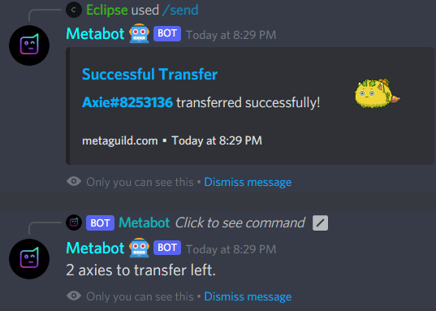

# /send axie

By typing `/send axie axie ID axie ID axie ID player: @tag`, you can transfer axies from Metaguild pools or any account to another player. If you do not mention a player, axies will move to the base.

.png>)

